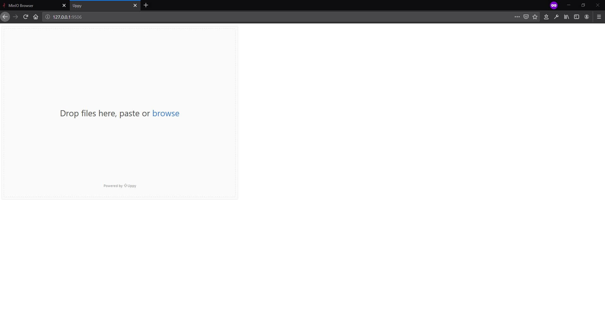
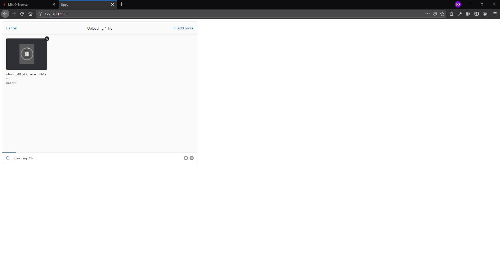

# tusd-example
Example using [MinIO](https://min.io/) as Amazon S3 Object Storage, [tusd](https://github.com/tus/tusd) as Server Implementation of tus: the open protocol for resumable file uploads https://tus.io/ and [Uppy](https://uppy.io/) as Frontend. All running on [Docker](https://www.docker.com/)

1. Start the services
```
$ docker-compose up -d
```

2. Open http://127.0.0.1:9000 in the browser


3. Login with the default credentials that are in the ```docker-compose.yaml``` file


4. Create a bucket called ```mybucket```


5. Open http://127.0.0.1:9506/ in the browser


6. Upload any file


7. Check that the file has been uploaded
